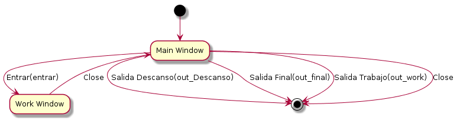

.. raw:: pdf

    PageBreak coverPage

Manual avançat BEMOUS
=====================

INTRODUCCIÓ
===========

Descripció
----------

Aquesta aplicació té la finalitat de fer un seguiment de la jornada laboral dels usuaris registrats al sistema.

Versió
------

Actualment, l'ultima versió d'aquesta aplicació es **0.1.0**.
 
 
Guia d'elements
===============

Jerarquia
---------

::

  class="GtkWindow" id="Login"
    |_class="GtkFixed" id="fixed1"
        |_class="GtkButton" id="Entrar"
        |_class="GtkButton" id="SalidaFinal"
        |_class="GtkButton" id="SalidaDescanso"
        |_class="GtkButton" id="SalidaTrabajo"
        |_class="GtkEntry" id="Usuario"
        |_class="GtkEntry" id="Hora"
        |_class="GtkEntry" id="Fecha"
        |_class="GtkEntry" id="Observacions"
        |_class="GtkLabel" id="labelObservaciones"

Descripció
----------

La finestra de **"Login"** (GtkWindow) esta organitza el contingut mitjançant el contenidor **"fixed1"** (GtkFixed), on están tots els components necessaris per a l'us de l'aplicació i que es descriuen a continuació.

:Entrar(Button): Botó per a registrar una entrada. (**signal: entrar**)
:SalidaFinal(Button): Botó per a registrar una sortida de final de jornada. (**signal:out_final**)
:SalidaDescanso(Button): Botó per a registrar una sortida de descans.(**signal:out_Descanso**)
:SalidaTrabajo(Button): Botó per a registrar una sortida de treball.(**signal:out_work**)
:Usuario(Entry): Entrada de text on s'introdueix el nom d'usuari.
:Hora(Entry): Entrada de text, que no es pot editar, que indica la hora del registre a realitzar.
:Fecha(Entry): Entrada de text, que no es pot editar, que indica la data del registre a realitzar.
:Observacions(Entry): Entrada de text que s'utilitzara per a realitzar comentaris.
:labelObservaciones(Label): Etiqueta per a les observacions.

Diagrama de fluxe
-----------------

.. note::
    Las accions entre finestres tenen el nom de la senyal entre parentesis
