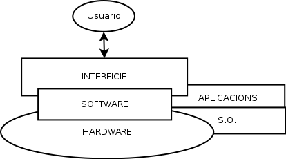

.. header::
    ###Section###
    

.. footer::
    ###Page###-###Total###

#############################
Desenvolupament d'interficies
#############################

******
Teoria
******
 
.. raw:: pdf
 
    PageBreak oneColumn

Definició grafica
==================

  
Categorització d'interficies
============================

- **GUI (Graphic User Interface):** Interficie grafica

- **CLI (Command Line Interface):** Interficie **NO** grafica
   
   
   
Objectius d'interficies
=======================
   
- Que sigui facil i agradable
   
Interficies S.O.
================

Windows: 
    - Finestres
    - Interficies WIMP(Windows, Icons, Menus, Pointer)

MacOS: 
    - Finestres
    - Interficies WIMP(Windows, Icons, Menus, Pointer)

Linux:
    - X Windows
    - KDE
    - OpenLock
    - Gnome => Eina: GLADE(GTK)
      
.. raw:: pdf
 
    PageBreak oneColumn

Caracteristicas interficies
===========================

- Accesible e intuitiva
- Utilizar metaforas(Imatges que ens diguin alguna cosa)
- Facil aprenentatge i us
- Consistent
- Oferir control de la aplicacio a l'usuari
- Anticipacio
- Reduïr carrega memoria(Que l'usuari no hagi de pensar)
- Llegible
- Autonoma
- Internacional
- Valors inicials(Anticipacio)
- Ergonomia (Llei de Fitch)(Colocació dels elements)

Definicions
===========

:Interficie: Es un conjunt d'elements (que poden pertanyer al SW o al HW) que ofereixen una informacio a l'usuari, i permetent, es a mes a mes, la interaccio (fisica o logica) entre l'usuari i l'ordinador, per mitja d'un dispositiu periferic o un enllaç de comunicacio.

Elementos GUI
=============
 
- Top Level
    - Ventanas
    - Cuadros de dialogo
    - Asistentes
       
- Menus
- Pestaña
- Barra de Herramientas
- Iconos
- Entorno de trabajo
- Controles
    - Botones
        -
        - radio button
        - checkbox
        - Boton con relieve
        - Combobox
        - Desplegables

Els controls son objectes que pereten un desenvolupament de la interficie mes senzilla gracies a la seva posibilitat de modularitat i reutilitzacio
Els controls tenen **propietats** i **metodes**, i es poden associar a **esdeveniments**
